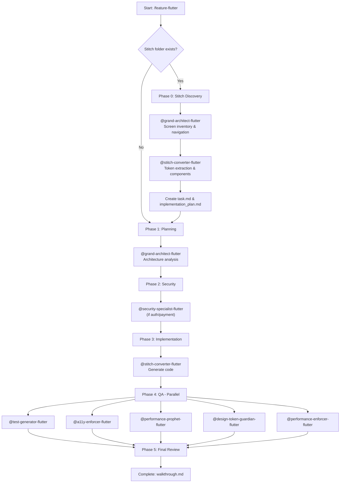

<!-- 🌟 SenaiVerse - Claude Code Agent System v2.2 | Flutter Edition | Enterprise -->

# Feature Implementation Workflow

> **📋 Feature Request:** $ARGUMENTS

## Execution Plan

Execute the following multi-agent workflow for Flutter development:

> [!TIP]
> **Starting a new project?** Run `/plan-product` first to generate a comprehensive Product Requirements Document (PRD) with features, screens, and architecture recommendations before using this workflow.

---

### Phase -1: PRD Discovery (AUTOMATIC when product_requirements.md exists)

> [!NOTE]
> If `./product_requirements.md` exists (created by `/plan-product`), this workflow will **automatically use it** as the foundation for development.

**Step -1.1: PRD Detection**

1. Search for `product_requirements.md` in project root
2. If found, extract:
   - Feature specifications (## ✨ Feature Specification / ## MVP Features)
   - Screen inventory (## 🗺️ Screen Inventory)
   - Technical architecture (## 🏗️ Technical Architecture)
   - Development roadmap (## 🚀 Development Roadmap)

**Step -1.2: PRD Integration** (INVOKE: @grand-architect-flutter)

When PRD is detected:

```yaml
Auto-Import from PRD:
  Features:
    - Use feature specifications as implementation guide
    - Follow acceptance criteria
    - Respect complexity ratings
  
  Screens:
    - Use screen inventory as target files
    - Follow navigation structure
    - Maintain route consistency
  
  Architecture:
    - Use recommended state management
    - Follow folder structure
    - Use suggested packages
  
  Roadmap:
    - Implement according to sprint order
    - Priority MVP features first
```

**Step -1.3: PRD Status Check**

```markdown
## PRD Integration Status

| Source | Detected | Action |
|--------|----------|--------|
| `product_requirements.md` | ✅/❌ | Use as foundation |
| `stitch_*/` folder | ✅/❌ | Extract designs |
| Both available | ✅/❌ | Merge PRD + Stitch |
```

> [!IMPORTANT]
> If BOTH PRD and Stitch are detected:
> - PRD provides **feature logic** and **architecture**
> - Stitch provides **UI design** and **tokens**
> - Workflow merges both automatically

---

### Phase 0: Stitch Design Discovery (MANDATORY when stitch_* exists)

> [!IMPORTANT]
> When a `stitch_*` folder is detected, this phase is **MANDATORY** and must be completed before any code generation.

**Step 0.1: Folder Scanning**

1. Search for `stitch_*` folders in project root
2. For each folder found, list ALL subfolders (these represent screens)
3. For each screen folder, verify:
   - `code.html` exists (HTML + TailwindCSS design)
   - `screen.png` exists (visual reference)
4. Count total screens and document any missing files

**Step 0.2: Screen Inventory** (INVOKE: @grand-architect-flutter)

Create a detailed inventory table:

```markdown
| # | Folder Name | Screen Name | Screen Type | Flutter Output | Navigation |
|---|-------------|-------------|-------------|----------------|------------|
| 1 | home/dashboard | Dashboard | Tab | dashboard_screen.dart | Bottom Nav |
| 2 | add_new_habit | Add Habit | Modal | add_habit_screen.dart | Push |
| 3 | calendar_view | Calendar | Tab | calendar_screen.dart | Bottom Nav |
| ... | ... | ... | ... | ... | ... |
```

**Screen Type Classification:**
- `Tab` → Bottom navigation main screens
- `Modal` → Full-screen dialogs (add_, create_, new_)
- `Detail` → Push screens with parameters (*_detail_*, *_view_*)
- `Form` → Edit/settings screens (edit_*, change_*, *_settings)

**Step 0.3: Design Token Extraction** (INVOKE: @stitch-converter-flutter)

Parse ALL `code.html` files and extract:

```yaml
Colors:
  Primary: # (main accent color)
  Background: # (light & dark)
  Surface: # (cards, containers)
  Text: # (primary, secondary)
  Accents: # (additional colors)

Typography:
  Font Family: # (primary, secondary)
  Weights: # (300, 400, 500, 600, 700)
  Sizes: # (text scale from design)

Spacing:
  Scale: # (4, 8, 12, 16, 20, 24, 32, 40, 48)
  
Border Radius:
  Variants: # (sm, md, lg, xl, full)

Shadows:
  Presets: # (sm, md, lg, glow)

Animation:
  Durations: # (fast, normal, slow)
```

**Step 0.4: Component Identification** (INVOKE: @stitch-converter-flutter)

Identify reusable UI patterns across screens:

```markdown
| Component | Used In | Description | Widget Name |
|-----------|---------|-------------|-------------|
| Habit Card | Dashboard, Calendar | Card with checkbox, emoji, streak | HabitCard |
| Progress Ring | Dashboard, Stats | Circular progress indicator | ProgressRing |
| Stat Card | Dashboard, Profile | Icon + label + value | StatCard |
| ... | ... | ... | ... |
```

**Step 0.5: Navigation Structure** (INVOKE: @grand-architect-flutter)

Define navigation architecture:

```markdown
Navigation Type: go_router (ShellRoute for bottom nav)

Tab Screens (Bottom Navigation):
1. / → DashboardScreen
2. /stats → StatisticsScreen
3. /calendar → CalendarScreen
4. /profile → ProfileScreen

Push Screens:
- /add-habit → AddHabitScreen (fullscreenDialog: true)
- /habit/:id → HabitDetailScreen
- /edit-profile → EditProfileScreen
- /change-password → ChangePasswordScreen
- /notification-settings → NotificationSettingsScreen

Onboarding Flow (if applicable):
- /onboarding → Onboarding sequence (PageView)
```

---

### Phase 0.6: Artifact Generation (REQUIRED)

> [!CAUTION]
> Do NOT proceed to code generation without creating these artifacts. This ensures proper tracking and user visibility.

**Create task.md:**

```markdown
# [Feature Name] - Stitch to Flutter Conversion

## Screens to Generate (X total)
- [ ] Screen 1: folder_name → screen_name.dart
- [ ] Screen 2: folder_name → screen_name.dart
...

## Components to Extract (X total)
- [ ] Component 1: ComponentName
- [ ] Component 2: ComponentName
...

## Theme Files (4 total)
- [ ] app_colors.dart
- [ ] app_typography.dart (or app_text_styles.dart)
- [ ] app_spacing.dart
- [ ] app_theme.dart

## Navigation Setup
- [ ] app_router.dart
- [ ] main_shell.dart (if bottom nav)

## Quality Assurance
- [ ] Accessibility check (@a11y-enforcer-flutter)
- [ ] Design token compliance (@design-token-guardian-flutter)
- [ ] Performance check (@performance-prophet-flutter)

## Tests
- [ ] Widget tests for screens
- [ ] Widget tests for components
- [ ] Golden tests (optional)

## Verification
- [ ] flutter pub get
- [ ] flutter analyze (0 warnings)
- [ ] flutter test (all passing)
```

**Create implementation_plan.md:**

Document detailed implementation strategy with file-by-file breakdown.

---

### Phase 1: Planning & Analysis

1. **Grand Architect Analysis** (INVOKE: @grand-architect-flutter)
   - Break down the feature into implementation steps
   - Analyze architectural impact on widget tree
   - Identify affected files (lib/ structure)
   - Determine state management approach (Provider/BLoC/Riverpod)
   - Assess complexity and risks
   - **Plan CI/CD integration** (GitHub Actions, Fastlane)
   - **Consider feature flags** for gradual rollout
   - **Plan analytics events** for tracking

2. **Feature Impact Assessment**
   - Estimate implementation time
   - Identify pubspec.yaml dependencies needed
   - Determine if platform-specific code required (iOS/Android)
   - Check if build_runner needed (code generation)
   - Assess breaking changes
   - **Plan i18n support** if user-facing text

### Phase 2: Security & Architecture Review

1. **Security Audit** (INVOKE: @security-specialist-flutter)
   If feature involves user data, auth, payments, or sensitive operations:
   - **OWASP Mobile Top 10** compliance check
   - Review FlutterSecureStorage usage
   - Check platform channel security
   - **Biometric authentication** implementation (if auth)
   - **JWT token handling** (validation, rotation)
   - **OAuth2/PKCE** for external auth
   - **Root/jailbreak detection** for sensitive features
   - **Screenshot prevention** for payment screens
   - **GDPR compliance** for user data

2. **State Management Planning**
   - Determine state architecture (ChangeNotifier, Cubit, StateNotifier)
   - Plan Provider/BLoC/Riverpod integration
   - Design data flow and widget rebuilds
   - Identify where const can be used
   - **Plan error tracking** (Sentry integration)

### Phase 2.5: Create Folder Structure (MANDATORY)

> [!CAUTION]
> **DO NOT SKIP THIS STEP!** Create all folders before writing any files.

**Create Feature Folders:**
```bash
# For each feature identified in Phase 0/1
mkdir -p lib/features/auth/{screens,widgets,models,providers}
mkdir -p lib/features/home/{screens,widgets,models,providers}
mkdir -p lib/features/profile/{screens,widgets,models,providers}
# ... repeat for all features
```

**Create Shared Resources:**
```bash
mkdir -p lib/shared/{theme,widgets,utils,constants,models}
```

**Create Routes:**
```bash
mkdir -p lib/routes
```

**Verification:**
```bash
tree lib/ -d -L 3  # Verify structure created correctly
```

**Example Output:**
```
lib/
├── features
│   ├── auth
│   │   ├── models
│   │   ├── providers
│   │   ├── screens
│   │   └── widgets
│   ├── home
│   │   ├── models
│   │   ├── providers
│   │   ├── screens
│   │   └── widgets
│   └── profile
│       ├── models
│       ├── providers
│       ├── screens
│       └── widgets
├── routes
└── shared
    ├── constants
    ├── models
    ├── theme
    ├── utils
    └── widgets
```

---

### Phase 3: Implementation

1. **Update Dependencies**
   - Add required packages to pubspec.yaml
   - Run `flutter pub get`
   - Run `flutter pub upgrade` if needed

2. **Generate Theme Files** (INVOKE: @stitch-converter-flutter)
   ```
   lib/theme/
   ├── app_colors.dart
   ├── app_typography.dart (or app_text_styles.dart)
   ├── app_spacing.dart
   └── app_theme.dart
   ```

3. **Generate Screen Widgets** (INVOKE: @stitch-converter-flutter)
   - Parse HTML structure for each screen
   - Convert to Flutter widget tree
   - Apply extracted theme tokens
   - Use Theme.of(context) for all colors/typography
   - **Update task.md** as each screen is completed

4. **Generate Reusable Components** (INVOKE: @stitch-converter-flutter)
   - Extract common patterns as widgets
   - Create lib/widgets/ folder
   - Use const constructors where possible

5. **Create Navigation Structure** (INVOKE: @stitch-converter-flutter)
   - Generate app_router.dart with go_router
   - Create main_shell.dart for bottom navigation
   - Update main.dart entry point

6. **Platform-Specific Implementation** (if needed)
   - Implement platform channels for iOS/Android
   - Handle Material vs Cupertino widgets
   - Update AndroidManifest.xml / Info.plist if needed
   - **Configure deep linking** (app_links)
   - **Setup push notifications** (FCM) if needed

7. **Code Generation** (if using build_runner)
   - Add annotations (freezed, json_serializable, retrofit)
   - Run `flutter pub run build_runner build --delete-conflicting-outputs`

### Phase 4: Quality Assurance (Parallel Execution) ⚡

Run ALL quality checks **in parallel** after implementation:

**1. Generate Tests** (INVOKE: @test-generator-flutter)
```
Execute in parallel:
- Widget tests for UI components
- Unit tests for business logic
- Integration tests if critical flow
- Golden tests for complex UI
- **State management tests** (Provider/Bloc)
- **API mocking** (Dio interceptors)
- **Test data factories** (Faker)
```

**2. Accessibility Check** (INVOKE: @a11y-enforcer-flutter)
```
Execute in parallel:
- Validate Semantics widgets
- Check touch target sizes (48x48 minimum)
- Verify color contrast (WCAG 2.2 AA)
- Test with screen readers (TalkBack/VoiceOver)
- **Motion/cognitive accessibility**
- **Keyboard focus management**
- **Dark mode accessibility**
```

**3. Performance Check** (INVOKE: @performance-prophet-flutter)
```
Execute in parallel:
- Predict build() method complexity
- Check for unnecessary rebuilds (setState anti-patterns)
- Validate const usage
- Check dispose() implementations
- Ensure 60fps maintained
- **Shader compilation jank prediction**
- **Cold start impact analysis**
- **Network waterfall detection**
```

**4. Design System Compliance** (INVOKE: @design-token-guardian-flutter)
```
Execute in parallel:
- Verify Theme.of(context) usage
- Check for hardcoded colors/sizes
- Validate const constructors
- **Dark mode token validation**
- **Animation token compliance**
- **Auto-fix suggestions**
```

**5. Runtime Performance** (INVOKE: @performance-enforcer-flutter)
```
Execute in parallel:
- Memory leak detection
- Dispose pattern validation
- Widget rebuild optimization
- Battery/power consumption
- Network request efficiency
```

> **⚡ Performance:** All 5 quality checks run simultaneously (~3-5 min vs ~10-15 min sequential)

### Phase 5: Final Review

1. **Code Review** (/review-flutter)
   - Run comprehensive Flutter review
   - Fix any issues found
   - Run `flutter analyze`
   - Fix lint warnings

2. **Build Validation**
   - Test on iOS simulator/device
   - Test on Android emulator/device
   - Verify APK/IPA size (`flutter build apk --analyze-size`)
   - **Verify Impeller performance** (`flutter run --enable-impeller`)

3. **Documentation**
   - Add inline comments for complex logic
   - Update CLAUDE.md if architectural changes
   - Document any platform-specific behavior

4. **CI/CD Setup** (if new feature)
   - Add to GitHub Actions workflow
   - Configure Codecov thresholds
   - Setup automated testing

5. **Finalize Artifacts**
   - Mark all items complete in task.md
   - Update implementation_plan.md if approach changed
   - Create walkthrough.md with screenshots/recordings

---

## Agent Orchestration Summary



---

## Success Criteria

✅ Feature implemented and working on iOS & Android
✅ All screens from Stitch folder converted
✅ Widget + integration tests generated and passing
✅ Accessibility compliant (Semantics, WCAG 2.2)
✅ No security vulnerabilities (OWASP compliant)
✅ Performance: 60fps maintained, const used
✅ Design system: No hardcoded values
✅ APK/IPA size within budget
✅ `flutter analyze` passes with no errors
✅ dispose() called for all controllers
✅ task.md fully marked complete
✅ **CI/CD pipeline configured**
✅ **Error tracking enabled** (Sentry)

---

## Commands to Run

```bash
# Add dependencies
flutter pub get

# Generate code (if using build_runner)
flutter pub run build_runner build --delete-conflicting-outputs

# Run tests
flutter test

# Run tests with coverage
flutter test --coverage

# Analyze code
flutter analyze

# Build and check size
flutter build apk --analyze-size
flutter build ios --analyze-size

# Run on device with Impeller
flutter run --enable-impeller

# Update golden files
flutter test --update-goldens
```

---

## Report

Provide summary:
- Stitch screens converted (X of Y)
- Files created/modified (lib/ paths)
- pubspec.yaml dependencies added
- Tests added (test/, integration_test/)
- Platform-specific changes (Android/iOS)
- Build size impact (+X MB)
- Performance validation (fps, const usage)
- Security measures implemented
- CI/CD configuration
- Any considerations for deployment
- Follow-up tasks if any

---

*© 2025 SenaiVerse | Command: /feature-flutter | Claude Code System v2.2 (Flutter Edition)*
