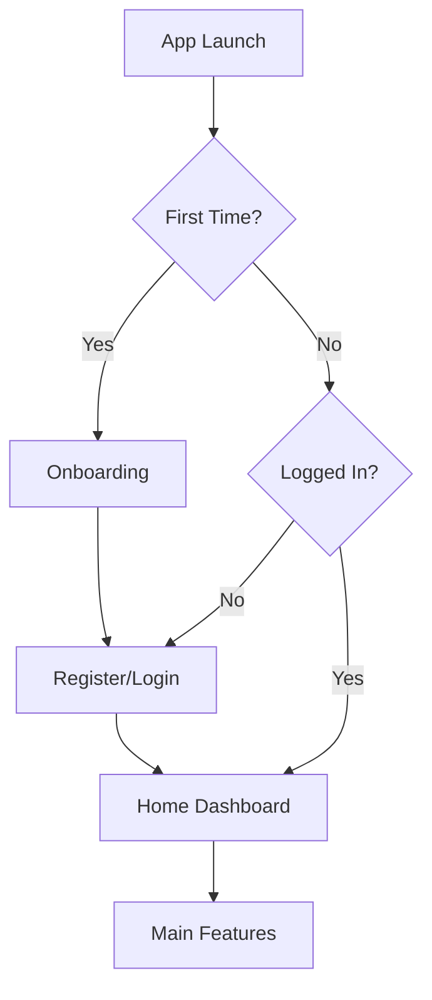
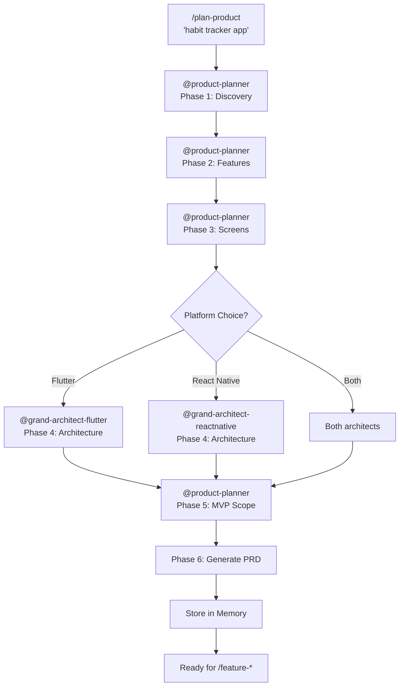

<!-- 🌟 SenaiVerse - Antigravity AI Agent System v2.3 | Plan Product Workflow | Enterprise -->

# Product Planning Workflow

> **📋 Product Idea:** $ARGUMENTS

## Overview

This workflow transforms a brief product idea into a comprehensive Product Requirements Document (PRD), ready for development with `/feature-flutter` or `/feature-reactnative`.

---

## Execution Plan

### Phase 1: Discovery & Vision (INVOKE: @product-planner)

**Step 1.1: Understand the Vision**

Extract core product information from user's brief:

```yaml
Questions to Answer:
  - What problem does this app solve?
  - Who is the primary target user?
  - What is the main value proposition?
  - What makes this unique from competitors?
  - What's the monetization strategy (if any)?
```

**Step 1.2: User Persona Definition**

Create detailed user persona:

```markdown
### Primary Persona: [Name]
- **Age Range:** [X-Y years]
- **Occupation:** [Typical job/role]
- **Tech Comfort:** [Low/Medium/High]
- **Pain Points:**
  1. [Pain point 1]
  2. [Pain point 2]
  3. [Pain point 3]
- **Goals:**
  1. [What they want to achieve]
  2. [Secondary goal]
```

---

### Phase 2: Feature Engineering (INVOKE: @product-planner)

**Step 2.1: Feature Brainstorm**

List ALL possible features without filtering:

```markdown
## Raw Feature List
1. [Feature from user's description]
2. [Standard feature for this app type]
3. [Feature that enhances UX]
4. [Feature seen in competitors]
...
```

**Step 2.2: Feature Prioritization**

Apply MoSCoW method:

| Priority | Label | Description | Count |
|----------|-------|-------------|-------|
| P0 | Must Have | Core MVP features | 5-8 |
| P1 | Should Have | Important but not critical | 5-10 |
| P2 | Could Have | Nice to have | 5-10 |
| P3 | Won't Have (Now) | Future roadmap | Any |

**Step 2.3: Feature Specification**

For each MVP feature, define:

```yaml
Feature: [Name]
  Description: [What it does]
  User Story: As a [user], I want [action] so that [benefit]
  Acceptance Criteria:
    - [Specific testable criterion]
    - [Another criterion]
  Complexity: [Low | Medium | High]
  Dependencies: [Other features or systems]
```

---

### Phase 3: Screen Mapping (INVOKE: @product-planner)

**Step 3.1: Screen Inventory**

Identify all required screens:

```markdown
| # | Screen Name | Category | Route | Priority |
|---|-------------|----------|-------|----------|
| 1 | Splash | Launch | / | MVP |
| 2 | Onboarding | Flow | /onboarding | MVP |
| 3 | Login | Auth | /login | MVP |
| 4 | Register | Auth | /register | MVP |
| 5 | Home/Dashboard | Main | /home | MVP |
| ... | ... | ... | ... | ... |
```

**Screen Categories:**
- `Launch` - Splash, loading
- `Auth` - Login, register, password reset
- `Flow` - Onboarding, tutorials
- `Main` - Primary app screens
- `Detail` - Drill-down views
- `Action` - Create, edit, delete screens
- `Settings` - Configuration, profile

**Step 3.2: Navigation Architecture**

Define navigation structure:

```markdown
## Navigation Structure

### Bottom Navigation (Main Tabs)
1. Home → /home
2. [Tab 2] → /[route]
3. [Tab 3] → /[route]
4. Profile → /profile

### Stack Screens
- Detail screens pushed on top
- Modal screens for forms
- Full-screen dialogs for creation

### Auth Flow
- Unauthenticated → /login or /onboarding
- Authenticated → /home
- Deep linking support
```

**Step 3.3: User Flow Diagrams**

Create key user flows:



---

### Phase 4: Technical Architecture (INVOKE: @grand-architect-flutter OR @grand-architect-reactnative)

**Step 4.1: Platform Selection**

Recommend platform based on requirements:

```yaml
Platform Analysis:
  Flutter:
    Pros: [Single codebase, performance, custom UI]
    Cons: [App size, platform-specific features]
    Best For: [Custom designs, animations, games]
  
  React Native:
    Pros: [Familiar stack, hot reload, native feel]
    Cons: [Bridge overhead, native module complexity]
    Best For: [Standard apps, existing web team, quick MVP]

Recommendation: [Platform] because [reason]
```

**Step 4.2: Architecture Recommendation**

Define technical stack:

```yaml
Frontend:
  Platform: [Flutter | React Native]
  Language: [Dart | TypeScript]
  State Management: [Provider/Bloc/Riverpod | Zustand/Redux]
  Navigation: [go_router | Expo Router]
  
Backend:
  Provider: [Firebase | Supabase | Custom API]
  Database: [Firestore | PostgreSQL | SQLite local]
  Authentication: [Firebase Auth | Supabase Auth | Custom]
  Storage: [Firebase Storage | S3 | Cloudinary]
  
Services:
  Analytics: [Firebase | Mixpanel | Amplitude]
  Crash Reporting: [Sentry | Crashlytics]
  Push Notifications: [FCM | OneSignal | Expo Push]
  Payments: [Stripe | RevenueCat] (if needed)
```

**Step 4.3: Data Model Design**

Define core entities:

```typescript
// Example: Habit Tracker
interface User {
  id: string;
  email: string;
  displayName: string;
  avatarUrl?: string;
  createdAt: Date;
  settings: UserSettings;
}

interface Habit {
  id: string;
  userId: string;
  name: string;
  emoji: string;
  frequency: 'daily' | 'weekly' | 'custom';
  targetDays?: number[];
  streak: number;
  completedDates: Date[];
  createdAt: Date;
}

// Add more entities as needed
```

---

### Phase 5: MVP Scope Definition (INVOKE: @product-planner)

**Step 5.1: MVP Feature Cut**

Define strict MVP boundary:

```markdown
## MVP Scope (4-6 weeks)

### ✅ Included
1. [Core feature 1] - P0
2. [Core feature 2] - P0
3. [Core feature 3] - P0
4. Basic authentication
5. Essential screens only
6. Local data persistence

### ❌ Excluded from MVP
1. [Nice feature] → Phase 2
2. [Advanced feature] → Phase 2
3. Social features → Phase 2
4. Advanced analytics → Phase 2
```

**Step 5.2: Sprint Planning**

Create development roadmap:

```markdown
## Development Roadmap

### Sprint 1: Foundation (Week 1-2)
- [ ] Project setup with architecture
- [ ] Design system (theme, tokens)
- [ ] Authentication flow
- [ ] Navigation setup
- [ ] Basic screen skeletons

### Sprint 2: Core Features (Week 3-4)
- [ ] [Main feature] implementation
- [ ] Data models & persistence
- [ ] API integration (if needed)
- [ ] Core UI components

### Sprint 3: Complete MVP (Week 5-6)
- [ ] Remaining MVP features
- [ ] Error handling
- [ ] Loading states
- [ ] Basic animations

### Sprint 4: Polish & Launch (Week 7-8)
- [ ] Testing suite
- [ ] Performance optimization
- [ ] Bug fixes
- [ ] Store preparation
- [ ] Beta release
```

---

### Phase 6: Documentation & Storage

**Step 6.1: Generate PRD** (INVOKE: @product-planner)

Create `product_requirements.md` following the template in @product-planner agent.

**Step 6.2: Store in Memory**

Save PRD to Antigravity memory:

```bash
# Memory location
.gemini/memory/products/[project_name]_prd.md
```

**Step 6.3: Create Project Summary**

Store reference in memory index:

```yaml
# .gemini/memory/products/index.yaml
projects:
  - name: [Project Name]
    created: [YYYY-MM-DD]
    platform: [Flutter | React Native | Both]
    status: [Planning | In Progress | Completed]
    prd_path: ./[project_name]_prd.md
    features_count: [X]
    screens_count: [X]
    mvp_weeks: [X]
```

---

## Agent Orchestration



---

## Output Artifacts

### 1. Product Requirements Document

**Path:** `product_requirements.md` (project root) or artifacts directory

**Contents:**
- Executive summary
- User personas
- Feature specifications
- Screen inventory
- Technical architecture
- Data models
- Development roadmap
- Risk assessment
- Success metrics

### 2. Memory Storage

**Path:** `.gemini/memory/products/[project_name]_prd.md`

**Purpose:**
- Reference during development
- Scope verification
- Feature tracking
- Architecture consistency

---

## Integration with Development Workflows

After PRD is approved, continue with:

### For Flutter Development:
```
/feature-flutter [First MVP Feature]
```

### For React Native Development:
```
/feature-reactnative [First MVP Feature]
```

### If Stitch Designs Available:
1. Place designs in `stitch_[project_name]/`
2. Run `/feature-flutter` or `/feature-reactnative`
3. Workflow auto-detects and converts

---

## Success Criteria

✅ Brief idea transformed into comprehensive PRD  
✅ User persona clearly defined  
✅ All MVP features prioritized and specified  
✅ Screen inventory complete with routes  
✅ Technical architecture recommended  
✅ Development roadmap created  
✅ PRD stored in Antigravity memory  
✅ User reviewed and approved PRD  
✅ Ready to proceed with development workflow  

---

## Example Usage

**Input:**
```
/plan-product I want to build a habit tracker app
```

**Process:**
1. @product-planner analyzes "habit tracker" domain
2. Generates features (daily tracking, streaks, reminders, stats)
3. Maps screens (dashboard, add habit, calendar, profile)
4. @grand-architect-* recommends Flutter with Provider + Firebase
5. Defines MVP scope (4 weeks)
6. Generates comprehensive PRD
7. Stores in memory

**Output:**
- `product_requirements.md` with 20+ pages of specs
- Memory entry for future reference
- Clear next steps with `/feature-*` command

---

## Commands Summary

```bash
# Start product planning
/plan-product [brief description of your app idea]

# Examples
/plan-product aplikasi habit tracker dengan gamifikasi
/plan-product e-commerce for local artisans
/plan-product social fitness app with challenges
/plan-product personal finance tracker
```

---

*© 2025 SenaiVerse | Workflow: /plan-product | Antigravity AI Agent System v2.3*
