# 🔄 Workflow Guide - Complete Usage Flow

A comprehensive guide explaining each workflow, when to use them, and the recommended development flow.

---

## 📋 Table of Contents

- [Overview](#overview)
- [Development Flow](#development-flow)
- [Workflow Details](#workflow-details)
- [Usage Examples](#usage-examples)
- [FAQ](#faq)

---

## Overview

The Antigravity AI Agent System provides **9 workflows** for mobile development:

| # | Workflow | Purpose | Platform |
|---|----------|---------|----------|
| 1 | `/plan-product` | Product discovery & PRD generation | Agnostic |
| 2 | `/feature-flutter` | Feature implementation | Flutter |
| 3 | `/feature-reactnative` | Feature implementation | React Native |
| 4 | `/review-flutter` | Code quality review | Flutter |
| 5 | `/review-reactnative` | Code quality review | React Native |
| 6 | `/test-flutter` | Test suite generation | Flutter |
| 7 | `/test-reactnative` | Test suite generation | React Native |
| 8 | `/stitch-flutter` | Design-to-code conversion | Flutter |
| 9 | `/stitch-reactnative` | Design-to-code conversion | React Native |

---

## Development Flow

### Recommended Workflow Order

```mermaid
flowchart TD
    A[💡 Product Idea] --> B{Have clear requirements?}
    
    B -->|No| C["/plan-product"]
    B -->|Yes| D{Have Stitch designs?}
    
    C --> C1["📄 Generates PRD\n• Features list\n• Screen inventory\n• Tech architecture\n• Development roadmap"]
    C1 --> D
    
    D -->|Yes| E["/feature-*\n(auto-detects stitch_*)"]
    D -->|No| F["/feature-*\n(generates UI from scratch)"]
    
    E --> G["🔧 Implementation\n• Phase 0: Stitch Discovery\n• Phase 1-5: Full development"]
    F --> G
    
    G --> H["/review-*"]
    H --> H1["📊 Quality Report\n• Design compliance\n• Accessibility\n• Security\n• Performance\n• Test coverage"]
    
    H1 --> I{Issues found?}
    I -->|Yes| J[Fix issues]
    J --> H
    I -->|No| K["/test-*"]
    
    K --> K1["🧪 Test Suite\n• Widget/Component tests\n• Unit tests\n• Integration tests\n• CI/CD setup"]
    
    K1 --> L["✅ Ready for Production"]
```



---

### Flow Summary Table

| Stage | Workflow | Input | Output |
|-------|----------|-------|--------|
| **1. Planning** | `/plan-product` | Brief idea | PRD document |
| **2. Implementation** | `/feature-*` | Feature request | Working code |
| **3. Quality Check** | `/review-*` | Existing code | Review report |
| **4. Testing** | `/test-*` | Existing code | Test suite |
| **5. Design Conversion** | `/stitch-*` | Stitch HTML | Native code |

---

## Workflow Details

### 1️⃣ `/plan-product` - Product Planning

**Purpose:** Transform a brief product idea into a comprehensive Product Requirements Document (PRD).

**When to Use:**
- ✅ Starting a new project
- ✅ You have a vague idea but need structure
- ✅ Need to define MVP scope
- ✅ Want architecture recommendations

**Input:**
```
/plan-product I want to build a habit tracker app with gamification
```

**Process:**
```
Phase 1: Vision Clarification
   └── Extract core product goals
   
Phase 2: Feature Engineering
   └── Identify and prioritize features (MoSCoW)
   
Phase 3: Screen Mapping
   └── Define all UI screens and navigation
   
Phase 4: Technical Architecture (via @grand-architect-*)
   └── Recommend tech stack and patterns
   
Phase 5: MVP Definition
   └── Create sprint-based roadmap
   
Phase 6: Documentation
   └── Generate product_requirements.md
   └── Store in Antigravity memory
```

**Output:**
- `product_requirements.md` - Complete PRD with:
  - User personas
  - Feature specifications
  - Screen inventory
  - Technical architecture
  - Development roadmap
  - Risk assessment

**Agents Used:**
- `@product-planner` - Product discovery
- `@grand-architect-*` - Technical architecture

---

### 2️⃣ `/feature-flutter` & `/feature-reactnative` - Feature Implementation

**Purpose:** Implement complete features with enterprise-grade quality.

**When to Use:**
- ✅ Implementing new features
- ✅ Building from PRD specifications
- ✅ Have Stitch designs to convert
- ✅ Need security/performance compliance

**Input:**
```
/feature-flutter Add user authentication with biometric support
/feature-reactnative Implement dashboard with charts
```

**Process:**
```
Phase -1: PRD Discovery (if product_requirements.md exists)
   └── Auto-detect and use PRD as foundation ← NEW!
   
Phase 0: Stitch Discovery (if stitch_* folder exists)
   └── Scan designs, extract tokens, map screens
   
Phase 1: Planning (@grand-architect-*)
   └── Architecture analysis, impact assessment
   
Phase 2: Security Review (@security-specialist-*)
   └── OWASP compliance, JWT, OAuth2
   
Phase 2.5: Create Folder Structure
   └── Set up feature-based architecture
   
Phase 3: Implementation (@stitch-converter-* if applicable)
   └── Generate theme, screens, components, navigation
   
Phase 4: Quality Assurance (5 agents in PARALLEL)
   ├── @test-generator-* (tests)
   ├── @a11y-enforcer-* (accessibility)
   ├── @performance-prophet-* (performance prediction)
   ├── @design-token-guardian-* (design compliance)
   └── @performance-enforcer-* (runtime optimization)
   
Phase 5: Final Review
   └── Code review, build validation, documentation
```

> [!TIP]
> If `product_requirements.md` exists from `/plan-product`, the workflow will **automatically use it** for:
> - Feature specifications
> - Screen inventory
> - Architecture decisions
> - Sprint planning

**Output:**
- Working feature code
- Unit/widget tests
- Updated documentation
- CI/CD configuration

**Agents Used:** 6+ agents (sequential + parallel)

---

### 3️⃣ `/review-flutter` & `/review-reactnative` - Code Review

**Purpose:** Comprehensive multi-agent code review with parallel execution.

**When to Use:**
- ✅ Before merging code
- ✅ After implementing features
- ✅ Periodic quality audits
- ✅ Security/performance validation

**Input:**
```
/review-flutter
/review-flutter Review authentication module
/review-reactnative Check payment feature
```

**Process:**
```
Phase 1: Parallel Reviews (5 agents simultaneously)
   ├── @design-token-guardian-* → Theme compliance, dark mode
   ├── @a11y-enforcer-* → WCAG 2.2, accessibility
   ├── @security-specialist-* → OWASP, JWT, biometric
   ├── @performance-prophet-* → Jank prediction, cold start
   └── @test-generator-* → Coverage analysis
   
Phase 2: Sequential Checks
   ├── Code quality (flutter analyze / ESLint)
   └── Platform-specific review
```

**Output:**
- Consolidated review report with:
  - 🚨 CRITICAL issues (must fix)
  - ⚠️ WARNINGS (should fix)
  - 💡 SUGGESTIONS (nice to have)
  - ✅ PASSES (what's good)
  - Performance score (X/10)
  - Security score (X/10)
  - Overall score (X/10)
  - Recommendation (Approve/Request Changes/Block)

**Agents Used:** 5+ agents (parallel execution)

**Time Saved:** ~10-13 minutes vs sequential

---

### 4️⃣ `/test-flutter` & `/test-reactnative` - Test Generation

**Purpose:** Generate comprehensive test suite with CI/CD integration.

**When to Use:**
- ✅ After implementing features
- ✅ Need to increase coverage
- ✅ Setting up CI/CD pipeline
- ✅ Adding tests to existing code

**Input:**
```
/test-flutter
/test-flutter Generate tests for CheckoutScreen
/test-reactnative Focus on authentication
```

**Process:**
```
Phase 1: Analysis
   └── Assess current coverage, identify gaps
   
Phase 2: Test Generation
   ├── Widget/Component tests (flutter_test / RNTL)
   ├── Unit tests for business logic
   ├── Integration tests for critical flows
   ├── Golden/Snapshot tests for UI
   ├── State management tests (Bloc/Provider/Redux/Zustand)
   └── API mocking (Dio interceptors / MSW)
   
Phase 3: CI/CD Setup
   ├── GitHub Actions configuration
   ├── Coverage thresholds (80%+)
   └── Codecov integration
```

**Output:**
- Complete test suite
- Test data factories
- CI/CD configuration files
- Coverage report

**Agents Used:** 3 agents

---

### 5️⃣ `/stitch-flutter` & `/stitch-reactnative` - Design Conversion

**Purpose:** Convert Google Stitch HTML designs to native code.

**When to Use:**
- ✅ Have Stitch-generated HTML designs
- ✅ Want quick UI code generation
- ✅ Need theme extraction
- ✅ Prototyping from designs

**Input:**
```
/stitch-flutter ./stitch_my_project
/stitch-reactnative ./stitch_dashboard
```

**Process:**
```
Phase 1: Design Discovery
   └── Scan stitch_* folder, list all screens
   
Phase 2: Token Extraction
   └── Extract colors, typography, spacing from TailwindCSS
   
Phase 3: Component Identification
   └── Find reusable UI patterns
   
Phase 4: Code Generation
   ├── Generate theme files
   ├── Generate screen widgets/components
   ├── Generate reusable components
   └── Generate navigation setup
   
Phase 5: Quality Check
   └── Basic accessibility and design compliance
```

**Output:**
- Screen files (`lib/screens/` or `app/`)
- Widget/component files
- Theme files (colors, typography, spacing)
- Navigation configuration

**Agents Used:** 4 agents

---

## Usage Examples

### Example 1: Complete New Project Flow

```bash
# Step 1: Start with product planning
/plan-product I want to build a habit tracker with gamification, 
              streaks, reminders, and social challenges

# Step 2: Review and approve PRD (product_requirements.md)

# Step 3: Implement first feature (after PRD approval)
/feature-flutter Implement user authentication with email and Google sign-in

# Step 4: Review the implementation
/review-flutter

# Step 5: Generate tests
/test-flutter Generate tests for authentication

# Step 6: Implement next feature
/feature-flutter Implement habit creation and tracking

# Repeat steps 4-6 for each feature...
```

### Example 2: With Stitch Designs

```bash
# Step 1: Download designs from Google Stitch
# Place in: ./stitch_habit_tracker/

# Step 2: Product planning (optional but recommended)
/plan-product Habit tracker app based on Stitch designs

# Step 3: Implement with auto-detection of Stitch
/feature-flutter Build habit tracker (auto-detects stitch_habit_tracker/)

# The workflow will:
# - Extract design tokens from Stitch
# - Generate themed screens
# - Apply accessibility
# - Run security checks
# - Generate tests
```

### Example 3: Quick Stitch-Only Conversion

```bash
# Just want the UI code without full implementation?
/stitch-flutter ./stitch_my_design

# Output:
# - lib/screens/*.dart
# - lib/widgets/*.dart
# - lib/theme/app_colors.dart
# - lib/theme/app_theme.dart
```

### Example 4: Code Quality Check

```bash
# Quick review of entire codebase
/review-flutter

# Review specific module
/review-flutter Review the payment module for security

# Output: Comprehensive report with scores and recommendations
```

---

## Workflow Comparison

| Feature | `/plan-product` | `/feature-*` | `/review-*` | `/test-*` | `/stitch-*` |
|---------|-----------------|--------------|-------------|-----------|-------------|
| **Purpose** | Product planning | Feature implementation | Code review | Test generation | Design conversion |
| **Input** | Brief idea | Feature request | Existing code | Existing code | Stitch HTML |
| **Output** | PRD document | Working code | Review report | Test suite | Native code |
| **Duration** | ~10-15 min | ~15-30 min | ~5-7 min | ~10-15 min | ~5-10 min |
| **Agents** | 2 | 6+ | 5+ (parallel) | 3 | 4 |
| **Stitch Required** | No | Optional | No | No | Yes |
| **Writes Code** | No | Yes | No | Yes | Yes |

---

## FAQ

### Q: Which workflow should I start with?
**A:** 
- New project → `/plan-product` first
- Have clear requirements → `/feature-*`
- Have Stitch designs → `/feature-*` (auto-detects) or `/stitch-*` (quick conversion)
- Existing code → `/review-*` for quality check

### Q: Can I skip `/plan-product`?
**A:** Yes! It's optional but recommended for new projects. If you have clear requirements, go directly to `/feature-*`.

### Q: What's the difference between `/feature-*` and `/stitch-*`?
**A:**
- `/feature-*` = Complete feature (Stitch + logic + tests + security + performance)
- `/stitch-*` = Quick UI conversion only (no business logic)

### Q: How long does each workflow take?
**A:**
- `/plan-product`: ~10-15 minutes
- `/feature-*`: ~15-30 minutes
- `/review-*`: ~5-7 minutes (parallel)
- `/test-*`: ~10-15 minutes
- `/stitch-*`: ~5-10 minutes

### Q: Can I run workflows in parallel?
**A:** No, run one workflow at a time. But within `/review-*`, agents run in parallel.

---

## Quick Reference

```bash
# Product Planning (start here for new projects)
/plan-product [brief description of your app idea]

# Feature Implementation
/feature-flutter [feature description]
/feature-reactnative [feature description]

# Code Review (parallel execution)
/review-flutter [optional: specific area to review]
/review-reactnative [optional: specific area to review]

# Test Generation
/test-flutter [optional: specific focus area]
/test-reactnative [optional: specific focus area]

# Design Conversion (requires stitch_* folder)
/stitch-flutter ./stitch_[project_name]
/stitch-reactnative ./stitch_[project_name]
```

---

**Need more details?** Check individual workflow files in `.agent/workflows/` for complete documentation.

---

*© 2025 SenaiVerse | Antigravity AI Agent System v2.4*
